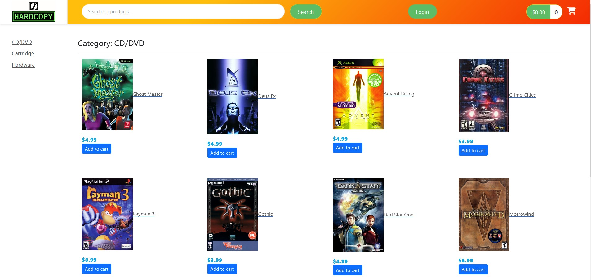
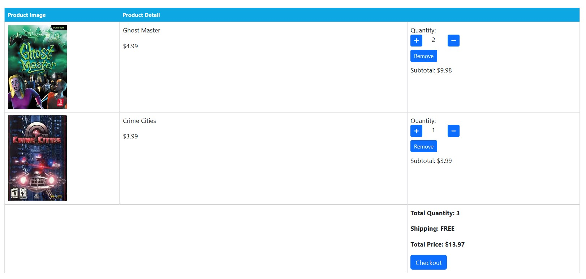
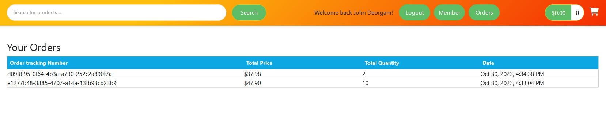

# Retro Video Game Shop
> Web application with Spring Boot back end and Angular front end.

## Table of Contents
* [General Info](#general-information)
* [Technologies Used](#technologies-used)
* [Features](#features)
* [Screenshots](#screenshots)
* [Setup](#setup)
* [Usage](#usage)
* [Project Status](#project-status)
* [Room for Improvement](#room-for-improvement)
* [Acknowledgements](#acknowledgements)

## General Information
- Website for shop with physical copies of video games on CD/DVD or cartridge.
- Project initially done as class asingment for Java WWW using only Spring Boot
- To train my skills i decided to remake front end with Angular framework

## Technologies Used
- Java - version 20.0.1
- Spring - version 3.1.2
- Angular - version 15.2.9
- Typescript - version 4.9.5
- Node - version 16.18.0
- MySQL - version 8.0.29

## Features
- VIP access to an account with OCTA
- Credit card transaction realised with Stripe

## Screenshots

## Requirements
- Make sure Java, node, typescript are installed
- Project requires IDE with Maven integration for example InteliJ
- MySQL Workbench to create database

## Usage
- Download files
- Extract files from _database-example_ zip folder
- Run database scripts
- Run backend project from _springboot-keyshop-main_ folder in InteliJ IDE _(File->open->pom.xml)_
- open _angular-keyshop-master_ folder in terminal or IDE integrated terminal and run command `npm-install` and then `npm-start`
  

## Project Status
_in progress_.

## Room for improvement:
- improve visual part of application 
- add additional benefits for registered users

## To do:
- migrate database online
- host demo application on web

## Acknowledgements
- This project was based on [this tutorial](https://www.udemy.com/course/full-stack-angular-spring-boot-tutorial/).

